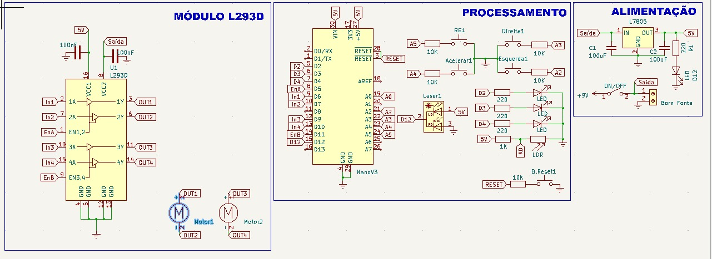

# Gigante de MDF

Projeto para a matéria de Programação de Hardware do sexto semestre de Engenharia da Computação

## Participantes

- Gustavo Lucio Silva de Souza
- Gustavo Silva Nusch
- Lucas Faria da Silva
- Rafaela da Silva Pinheiro

## Sobre

Esse projeto consiste num robô atirador de laser para competição entre alunos da disciplina Programação de Hardware da Universidade Santa Cecília.

Chamado de Gigante de MDF, o robô possui 3 vidas elucidadas por LEDS em sua parte superior. Sua locomoção é feita por duas rodas que são controladas através de um controle com fio confeccionado pelo grupo.

A proposta do projeto consiste em uma competição entre os robôs de cada grupo, onde através de um laser para emitir "dano" e um LDR para recepção desse dano, fossem subtraídas as vidas do Gigante para que assim, houvesse um vencedor.

## Componentes e esquemático

|   Componentes   | Quantidade |
|:---------------:|:----------:|
| Arduino NANO    |     x1     |
| Bateria 9V      |     x1     |
| Borne           |     x13    |
| Botão           |     x1     |
| Capacitor 100nF |     x2     |
| Capacitor 100uF |     x2     |
| Chave           |     x5     |
| Clip Bateria    |     x1     |
| Laser 5mW       |     x1     |
| LM7805          |     x1     |
| L293D           |     x1     |
| Motor DC        |     x2     |
| Resistor 220    |     x4     |
| Resistor 1K     |     x1     |
| Resistor 10K    |     x5     |

## Softwares

- Arduino IDE
- Doxygen
- Flashprint
- Fusion 360
- KiCad
- PCB-Proto Studio 
- RDWorks
- SimulIDE

